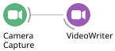
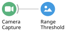
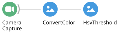
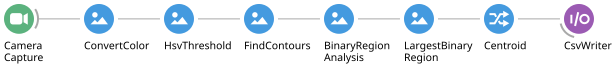
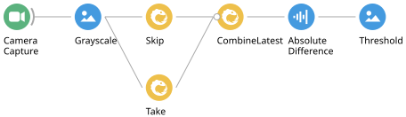
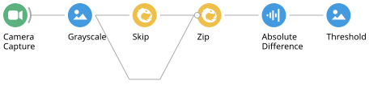
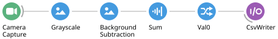

# Acquisition and Tracking

Bonsai can acquire and record data from many different devices. These exercises
introduce the most common Bonsai data types, starting with images.

## Video acquisition

An image is a 2D matrix of pixels. Each pixel is either a brightness value in a
grayscale image, or a BGR colour value in a colour image.

### **Exercise 1:** Saving a video

* Insert a `CameraCapture` source.
* Insert a `VideoWriter` sink.
* Configure the `FileName` property of `VideoWriter` with a name ending in `.avi`.
* Run the workflow and check that it produces a valid video file.

### **Exercise 2:** Saving a grayscale video

* Insert a `Grayscale` transform between `CameraCapture` and `VideoWriter`.
* Run the workflow — the output should now be a grayscale movie.
* Modify the workflow so that it records a colour **and** a grayscale movie
  simultaneously.

## Audio acquisition

Audio is sampled far faster than video, and arrives in buffered chunks of many
samples. Multi-channel buffers are represented as a 2D matrix where rows are
channels and columns are time.

### **Exercise 3:** Saving a WAV file

* Insert an `AudioCapture` source.
* Insert an `AudioWriter` sink.
* Configure `FileName` with a name ending in `.wav`.
* Make sure the `SamplingFrequency` of `AudioWriter` matches the capture rate.
* Run for a few seconds and play the file back to check it is valid.

## Video tracking

Bonsai can process captured video in real time to extract measures of behaviour or other
derived quantities. The exercises below introduce some of those online processing
capabilities.

### **Exercise 4:** Segmentation of a coloured object

* Insert a `CameraCapture` source.
* Insert a `RangeThreshold` transform.
* Open the visualizer for the `RangeThreshold` operator.
* Configure its `Lower` and `Upper` properties to isolate your coloured object.

> [!TIP]
> Click the small arrow to the left of each property to expand its individual values.

This method segments coloured objects by setting boundaries directly on the BGR colour
space, which is a poor choice for colour segmentation. **Question:** can you see why?

* Replace the `RangeThreshold` operator with a `ConvertColor` transform. This node converts
  the image from BGR to the
  [Hue-Saturation-Value (HSV) colour space](https://en.wikipedia.org/wiki/HSL_and_HSV).
* Insert an `HsvThreshold` transform.
* Configure its `Lower` and `Upper` properties to isolate the object.
* Test the resulting segmentation under different illumination conditions.

### **Exercise 5:** Real-time position tracking

* Starting from the workflow in the previous exercise, insert a `FindContours` transform.
  This operator traces the contours of all the objects in a black-and-white image, where an
  *object* is a region of connected white pixels.
* Insert a `BinaryRegionAnalysis` transform. This node calculates the area, centre of mass
  and orientation of every detected contour.
* Insert a `LargestBinaryRegion` transform to extract the largest detected object.
* Select the `ConnectedComponent` > `Centroid` field from the right-click context menu.
* Record the position of the centroid using a `CsvWriter` sink.
* **Optional:** open the CSV file in Python, MATLAB or R and plot the trajectory of the
  object.

### **Exercise 6:** Background subtraction and motion segmentation

* Create a grayscale video workflow like the one in Exercise 2.
* Insert a `Skip` operator and set its `Count` property to 1.
* In a new branch, insert a `Take` operator and set its `Count` property to 1.
* Combine the images from both branches using the `CombineLatest` combinator.
* Insert an `AbsoluteDifference` transform after `CombineLatest`.
* Insert a `Threshold` transform, visualize its output, and adjust the `ThresholdValue`
  property.
* **Question:** describe in your own words what this workflow is doing.

* Replace the `CombineLatest` operator with the `Zip` combinator.
* Delete the `Take` operator.
* **Question:** describe in your own words what the modified workflow is doing.

### **Exercise 7:** Measuring motion

* Create a grayscale video stream like the one in Exercise 2.
* Insert a `BackgroundSubtraction` transform and set its `AdaptationRate` property to 1.
* Insert a `Sum (Dsp)` transform, which sums the values of all the pixels in the image.
* Run the workflow, point the camera at a moving object and visualize the output of `Sum`.
  Compare small movements to large ones. **Question:** what happens to the signal when the
  object holds perfectly still?
* Select the `Scalar` > `Val0` field from the right-click context menu.

> [!NOTE]
> `Sum (Dsp)` adds up pixel values across all colour channels. In a grayscale image there
> is only one active channel, and its total is stored in `Val0`.

* Record the motion of the object using a `CsvWriter` sink.

Next: [Closed-Loop Systems](03-closed-loop.md). To bring in real hardware, see the
[Hobgoblin](../hobgoblin/index.md) section.
