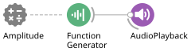
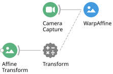
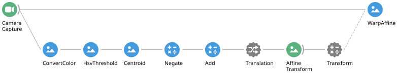

# Closed-Loop Systems

In a closed-loop experiment, we want the behaviour data to generate feedback in
real-time into the external world, establishing a relationship where the output
of the system depends on detected sensory input. Many behavioural experiments in
neuroscience require some kind of closed-loop interaction between the subject and
the experimental setup. The exercises below will show you how to use the online
data processing capabilities of Bonsai to create and benchmark many different
kinds of closed-loop systems.

> [!NOTE]
> Exercises 1 to 3 have been converted to the [Hobgoblin](../hobgoblin/index.md).
> Exercises 4 and 5 use the camera and the host only, so they need no changes.

## Measuring closed-loop latency

One of the most important benchmarks to evaluate the performance of a closed-loop
system is the latency, or the time it takes for a change in the output to be
generated in response to a change in the input.

The easiest way to measure the latency of a closed-loop system is to use a
digital feedback test. In this test, we measure a binary output from the
closed-loop system and feed it directly into the input sensor. We then record a
series of measurements where we change the output to `HIGH` if the sensor detects
`LOW`, and change it to `LOW` if the sensor detects `HIGH`. The time interval
between `HIGH` and `LOW` signals will give us the total closed-loop latency of the
system, also known as the round-trip time.

### **Exercise 1:** Measuring serial port communication latency

Completed workflow: [`03-closed-loop-01.bonsai`](../workflows/03-closed-loop-01.bonsai)

* Connect `GP22` on the Hobgoblin to `GP2` using a jumper wire.

#### Setting up the device

* Insert a `BehaviorSubject` source, set its `TypeArguments` to `HarpMessage`, and
  set its `Name` property to `Commands`.
* Insert a `Device` source (from `Harp.Hobgoblin`) after it, and configure the
  `PortName` property with the COM port your board is connected to.
* Insert a `PublishSubject` after the `Device` and set its `Name` property to `Events`.

> [!NOTE]
> This three-node arrangement is the standard way to drive a Harp device. Anything
> multicast to `Commands` is sent to the board, and everything the board reports is
> published on `Events`. Because the command subject feeds *into* the device, any
> branch of the workflow can write to the hardware — which is what makes the loop
> below possible.

#### Reading the digital input

* Insert a `SubscribeSubject` and set its `Name` property to `Events`.
* Insert a `Parse` transform and set its `Register` property to `DigitalInputState`.
* Insert a `BitwiseAnd` transform and set its `Value` property to `GP2`.
* Insert an `Equal` transform and set its `Value` property to 1.

> [!NOTE]
> A Harp device reports the state of *all* its digital inputs in a single
> `DigitalInputState` message. `Parse` picks out those messages, `BitwiseAnd` masks
> off everything except the `GP2` bit, and `Equal` turns the masked result into a
> boolean that is `True` whenever `GP2` reads `HIGH`.

#### Writing back the inverted state

A Harp device does not have a single "digital output" register to write an inverted
value into — outputs are raised and lowered through two separate registers,
`DigitalOutputSet` and `DigitalOutputClear`. So in place of one `BitwiseNot`, we
route the boolean down two branches and send a different message on each.

* Insert a `Condition` operator and set its `Name` property to `OFF`. Double-click
  it and insert a `BitwiseNot` between `Source1` and `WorkflowOutput`, so the branch
  only passes events where `GP2` is `LOW`.
* After the `OFF` condition, insert a `CreateMessage` operator. Set its
  `MessageType` property to `Write`, its `Payload` to `CreateDigitalOutputSetPayload`,
  and the payload's `DigitalOutputSet` property to `GP22`.
* In a new branch from the `Equal` transform, insert a second `Condition` and set its
  `Name` property to `ON`. Leave its contents as the default pass-through, so the
  branch only passes events where `GP2` is `HIGH`.
* After the `ON` condition, insert another `CreateMessage`. Set its `MessageType`
  property to `Write`, its `Payload` to `CreateDigitalOutputClearPayload`, and the
  payload's `DigitalOutputClear` property to `GP22`.
* Join both branches with a `Merge` combinator.
* Insert a `MulticastSubject` and set its `Name` property to `Commands`.

The loop is now closed: reading `LOW` raises `GP22`, reading `HIGH` lowers it, and
because `GP22` is wired back to `GP2` the board oscillates as fast as the round trip
allows.

#### Measuring the interval

* Insert a `TimeInterval` operator after the `MulticastSubject`.
* Right-click on the `TimeInterval` operator and select `Output` > `Interval` > `TotalMilliseconds`.

> [!NOTE]
> The `TimeInterval` operator measures the interval between consecutive events in
> an observable sequence using the
> [high-precision event timer (HPET)](https://en.wikipedia.org/wiki/High_Precision_Event_Timer)
> in the computer. The HPET has a frequency of at least 10MHz, allowing us to
> accurately time intervals with sub-microsecond precision.

* Run the workflow and measure the round-trip time between digital input messages.
* **Question:** the interval is measured on the host, between outgoing commands. Which
  parts of that time are spent on the device, and which on the host?

> [!NOTE]
> **TODO:** this exercise needs a workflow figure. Export one from the Bonsai editor
> with **File → Export Image** and save it as `images/closed-loop-latency-hobgoblin.svg`.
> The old Arduino figure (`images/closed-loop-latency-arduino.svg`) is kept for
> reference until the new one is in place.

### **Exercise 2:** Measuring video acquisition latency

Completed workflow: [`03-closed-loop-02.bonsai`](../workflows/03-closed-loop-02.bonsai)

This is the same digital feedback test as Exercise 1, but with the jumper wire
replaced by a camera: instead of feeding `GP22` straight back into `GP2`, we point a
camera at an LED driven by `GP22` and detect the light in the video stream. The extra
round-trip time we measure is therefore the cost of acquiring and processing a frame.

* Connect a red LED to `GP22` on the Hobgoblin.
* Point the camera at the LED so that it is clearly visible in the image.

#### Setting up the device

* Reproduce the `Commands` / `Device` / `Events` scaffold from Exercise 1: a
  `BehaviorSubject` named `Commands` with `TypeArguments` set to `HarpMessage`, a
  `Device` source (from `Harp.Hobgoblin`) with its `PortName` configured, and a
  `PublishSubject` named `Events`.

> [!NOTE]
> This exercise never reads from `Events` — the input now arrives through the camera.
> Keep the subject anyway: it is the standard device arrangement, and having the
> board's messages published makes them available to any visualizer or logging branch
> you add later.

* In a new branch, insert a `CreateMessage` source. Set its `MessageType` property to
  `Write`, its `Payload` to `CreateDigitalOutputClearPayload`, and the payload's
  `DigitalOutputClear` property to `GP22`.
* Insert a `MulticastSubject` after it and set its `Name` property to `Commands`.

> [!NOTE]
> With no input connected, `CreateMessage` acts as a source and emits a single message
> when the workflow starts. This branch guarantees the LED begins in a known `LOW`
> state, so the loop always starts from "dark" rather than from whatever the board was
> left in.

#### Detecting the LED in the video

* Insert a `CameraCapture` source.
* Insert a `Crop` transform.
* Run the workflow and set the `RegionOfInterest` property to a small area around the LED.

> [!TIP]
> You can use the visual editor for an easier calibration. While the workflow is
> running, right-click on the `Crop` transform and select `Show Default Editor`
> from the context menu, or click the small button with ellipsis that appears when
> you select the `RegionOfInterest` property.

* Insert a `Sum (Dsp)` transform and select the `Val2` field from the output.

> [!NOTE]
> The `Sum (Dsp)` operator adds the value of all the pixels in the image together,
> across all the colour channels. Assuming the default BGR format, the result of
> summing all the pixels in the Red channel of the image will be stored in `Val2`.
> `Val0` and `Val1` would store the Blue and Green values, respectively. If you are
> using an LED with a colour other than red, select the output field accordingly.

* Insert a `GreaterThan` transform.
* Run the workflow and use the visualizer of the `Sum` operator to choose an
  appropriate threshold for the `Value` property of `GreaterThan`. The output should
  be `True` only while the LED is lit — check this by toggling the LED by hand, or by
  temporarily connecting the boolean straight through to the output branch below.
* Insert a [`DistinctUntilChanged`](https://bonsai-rx.org/docs/operators/distinctuntilchanged)
  operator after the `GreaterThan` transform.

> [!NOTE]
> The `DistinctUntilChanged` operator filters consecutive duplicate items from an
> observable sequence. The camera delivers a frame every few milliseconds, so without
> this operator we would send a command to the board on *every* frame and end up
> measuring the frame interval rather than the closed-loop latency. With it, a command
> is only sent when the detected state actually changes from `LOW` to `HIGH`, or
> vice-versa.

#### Writing back the inverted state

As in Exercise 1, the inversion is done by routing the boolean down two branches
rather than with a single `BitwiseNot`, because raising and lowering an output are
separate registers on a Harp device.

* Insert a `Condition` operator after `DistinctUntilChanged` and set its `Name`
  property to `OFF`. Double-click it and insert a `BitwiseNot` between `Source1` and
  `WorkflowOutput`, so the branch only passes events where the LED was *not* detected.
* After the `OFF` condition, insert a `CreateMessage` operator. Set its `MessageType`
  property to `Write`, its `Payload` to `CreateDigitalOutputSetPayload`, and the
  payload's `DigitalOutputSet` property to `GP22`.
* In a new branch from `DistinctUntilChanged`, insert a second `Condition` and set its
  `Name` property to `ON`. Leave its contents as the default pass-through, so the
  branch only passes events where the LED *was* detected.
* After the `ON` condition, insert another `CreateMessage`. Set its `MessageType`
  property to `Write`, its `Payload` to `CreateDigitalOutputClearPayload`, and the
  payload's `DigitalOutputClear` property to `GP22`.
* Join both branches with a `Merge` combinator.
* Insert a `MulticastSubject` and set its `Name` property to `Commands`.

The loop is now closed through the camera: a dark region of interest lights the LED, a
bright one extinguishes it, and the board flickers at whatever rate the video round
trip allows.

#### Measuring the interval

* Insert a `TimeInterval` operator after the `MulticastSubject`.
* Right-click on the `TimeInterval` operator and select `Output` > `Interval` > `TotalMilliseconds`.
* Run the workflow and measure the round-trip time between LED triggers.
* **Question:** given these measurements, and the serial round trip you measured in
  Exercise 1, what would you estimate is the **input** latency for video acquisition?
* **Question:** how does the measured interval compare to the frame interval of your
  camera? What does that tell you about the smallest latency a video-based closed
  loop can achieve?

> [!NOTE]
> **TODO:** this exercise needs a workflow figure. Export one from the Bonsai editor
> with **File → Export Image** and save it as `images/closed-loop-latency-video-hobgoblin.svg`.
> The old Arduino figure (`images/closed-loop-latency-video.svg`) is kept for
> reference until the new one is in place.

## Closed-loop control

### **Exercise 3 (challenge):** Triggering a digital line based on region of interest activity

Exercise 2 already contains everything you need for a working closed loop: a region of
the camera view is reduced to a single number, that number is thresholded into a
boolean, and the boolean drives `GP22` on the board. The only reason it flickers is
that we deliberately pointed the camera at the LED it controls.

**The challenge:** starting from your Exercise 2 workflow, make the LED turn on while
there is *activity* in a chosen region of the camera view — for example when you move
your hand through it — and turn off again when the region is clear.

> [!TIP]
> **Hints**
>
> * Point the camera at the scene rather than at the LED, and use `Crop` to select the
>   region you care about.
> * `Sum (Dsp)` on a raw colour image is a blunt instrument. Experiment with
>   `Grayscale` and `Threshold (Vision)` before summing, so that the value you
>   threshold reflects how much of the region changed rather than its overall
>   brightness. On a single-channel image the sum is in the `Val0` field.
> * Use the visualizers as you build: check what values come out of `Sum` with the
>   region empty and with your hand in it, and pick the `GreaterThan` threshold from
>   those two ranges.
> * Think about the polarity of the two `Condition` branches. In Exercise 2 detecting
>   light *extinguished* the LED; here detecting activity should *light* it.
> * `DistinctUntilChanged` is still worth keeping, so the board only receives a command
>   when the state actually changes.

* **Optional:** Replace the `Crop` transform with a `CropPolygon` to allow for
  non-rectangular regions.

> [!NOTE]
> The `CropPolygon` operator uses the `Regions` property to define multiple,
> possibly non-rectangular regions. The visual editor is similar to `Crop`, where
> you draw a rectangular box. However, in `CropPolygon` you can move the corners of
> the box by right-clicking *inside* the box and dragging the cursor to the new
> position. You can add new points by double-clicking with the left mouse button,
> and delete points by double-clicking with the right mouse button. You can delete
> regions by pressing the `Del` key and cycle through selected regions by pressing
> the `Tab` key.

### **Exercise 4:** Modulating stimulus intensity based on distance to a point

* Insert a `FunctionGenerator` source.
* Set the `Amplitude` property to 500, and the `Frequency` property to 200.
* Insert an `AudioPlayback` sink.
* Externalize the `Amplitude` property of the `FunctionGenerator` using the
  right-click context menu.

If you run the workflow, you should hear a pure tone coming through the speakers.
The `FunctionGenerator` periodically emits buffered waveforms with values ranging
between 0 and `Amplitude`, the shape of which changes the properties of the tone.
For example, by changing the value of `Amplitude` you can make the sound loud or
soft. The next step is to modulate the `Amplitude` property dynamically based on
the distance of the object to a target.

* Create a video tracking workflow using `ConvertColor`, `HsvThreshold`, and the
  `Centroid` operator to directly compute the centre of mass of a coloured object.
* Insert a `Subtract` transform and configure the `Value` property to be some
  target coordinate in the image.

The result of the `Subtract` operator will be a vector pointing from the target to
the centroid of the largest object. The desired distance from the centroid to the
target would be the length of that vector.

* Insert an `ExpressionTransform` operator. This node allows you to write small
  mathematical and logical expressions to transform input values.
* Right-click on the `ExpressionTransform` operator and select `Show Default Editor`.
  Set the expression to `Math.Sqrt(X*X + Y*Y)`.

> [!NOTE]
> Inside the `Expression` editor you can access any field of the input by name. In
> this case `X` and `Y` represent the corresponding fields of the `Point2f` data
> type. You can check which fields are available by right-clicking the previous
> node. You can use all the normal arithmetical and logical operators as well as the
> mathematical functions available in the
> [`Math`](https://learn.microsoft.com/dotnet/api/system.math) type. The default
> expression `it` means "input" and represents the input value itself.

* Connect the `ExpressionTransform` operator to the externalized `Amplitude` property.
* Run the workflow and verify that stimulus intensity is modulated by the distance
  of the object to the target point.
* **Optional:** Modulate the `Frequency` property instead of `Amplitude`.
* **Optional:** Use the `Rescale` operator to adjust the gain of the modulation by
  configuring the `Min`, `Max`, `RangeMax` and `RangeMin` properties. Set the
  `RescaleType` property to `Clamp` to restrict the output values to an allowed range.

> [!NOTE]
> You can specify inverse relationships using `Rescale` if you set the *maximum*
> input value to the `Min` property, and the *minimum* input value to the `Max`
> property. In this case, a small distance will generate a large output, and a large
> distance will produce a small output.

### **Exercise 5:** Centring the video on a tracked object

* Insert a `CameraCapture` source.
* Insert a `WarpAffine` transform. This node applies affine transformations on the
  input defined by the `Transform` matrix.
* Externalize the `Transform` property of the `WarpAffine` operator using the
  right-click context menu.
* Create an `AffineTransform` source and connect it to the externalized property.
* Run the workflow and change the values of the `Translation` property while
  visualizing the output of `WarpAffine`. Notice that the transformation induces a
  translation in the input image controlled by the values in the property.

* In a new branch, create a video tracking pipeline using `ConvertColor`,
  `HsvThreshold`, and the `Centroid` operator to directly compute the centre of
  mass of a coloured object.
* Insert a `Negate` transform. This will make the X and Y coordinates of the
  centroid negative.

We now want to map our negative centroid to the `Translation` property of
`AffineTransform`, so that we dynamically translate each frame using the negative
position of the object. You can do this by using
[property mapping operators](https://bonsai-rx.org/docs/articles/property-mapping.html).

* Insert an `InputMapping` operator.
* Connect the `InputMapping` to the `AffineTransform` operator.
* Open the `PropertyMappings` editor and add a new mapping to the `Translation` property.
* Run the workflow. Verify the object is always placed at position (0,0).
  **Question:** what is the problem?

> [!NOTE]
> Generally for image coordinates, (0,0) is at the top-left corner, and the centre
> will be at coordinates (width/2, height/2) — usually (320,240) for images with
> 640 x 480 resolution.

* Insert an `Add` transform. This will add a fixed offset to the point. Configure
  the `Value` property with an offset that will place the object at the image
  centre, e.g. (320,240).
* Run the workflow, and verify the output of `WarpAffine` is now a video which is
  always centred on the tracked object.
* **Optional:** Insert a `Crop` transform after `WarpAffine` to select a bounded
  region around the object.
* **Optional:** Modify the object tracking workflow to use `FindContours` and
  `BinaryRegionAnalysis`.

Next: [Data Synchronization](04-synching.md).
