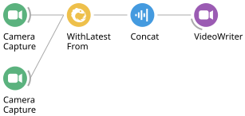
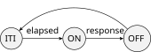
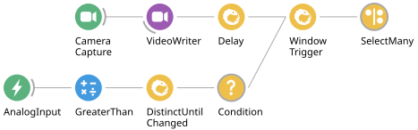
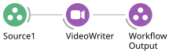

# Data Synchronization

Synchronizing behaviour and other experimental events with stimulation or recorded
neural data is a fundamental component of neuroscience data collection and
analysis. The exercises below will walk you through some common synchronization
problems encountered in systems neuroscience experiments, and how to handle them
using Bonsai.

> [!NOTE]
> Exercises 2 to 4 have been converted to the [Hobgoblin](../hobgoblin/index.md).
> Exercise 5 still uses the Arduino `AnalogInput` source and its wiring, and is being
> rewritten.

### **Exercise 1:** Synchronizing video from two webcams

* Insert a `CameraCapture` source and set it to index 0.
* Insert another `CameraCapture` source and set it to index 1.
* Combine both sources using a `WithLatestFrom` combinator.
* Insert a `Concat (Dsp)` operator and set its `Axis` property to 1.
* Insert a `VideoWriter` sink and record a small segment of video.
* **Question:** how would you test the synchronization between the two video streams?

> [!TIP]
> You can use the `FileCapture` source to inspect the video frame by frame by
> setting the `Playing` property to `False`. After setting the `FileName` property
> to match your recorded video, run the workflow, open the source visualizer, then
> right-click on top of the video frame to open up the seek bar at the bottom. You
> can use the arrow keys to move forward and back on individual frames.

## Reaction time

For this and subsequent worksheets, we will use a simple reaction time task as our
model systems neuroscience experiment. In this task, the subject needs to press a
button as fast as possible following a stimulus, as described in the following
diagram:

The task begins with an inter-trial interval (`ITI`), followed by stimulus
presentation (`ON`). After stimulus onset, advancement to the next state can happen
only when the subject presses the button (`success`) or a timeout elapses (`miss`).
Depending on which event is triggered first, the task advances either to the
`Reward` state, or `Fail` state. At the end, the task goes back to the beginning of
the ITI state for the next trial.

### **Exercise 2:** Generating a fixed-interval stimulus

Completed workflow: [`04-synching-02.bonsai`](../workflows/04-synching-02.bonsai)

In this first exercise, you will assemble the basic hardware and software
components required to implement the reaction time task.

#### Wiring

| Component | Pin | Used from |
| --- | --- | --- |
| LED (stimulus) | `GP22` | Exercise 2 |
| Push button (response) | `GP2` | Exercise 3 |

Wire both now, so you do not have to take the board apart between exercises.

> [!NOTE]
> Unlike the Arduino version of this task, there is no need to duplicate the LED wire
> into an analog input to record the stimulus. The Hobgoblin timestamps every message
> it exchanges with the host, so the commands that drive `GP22` and the events reported
> by `GP2` already arrive with device time attached — which is the whole point of the
> exercises that follow.

#### Setting up the device

We will start by using a fixed-interval blinking LED as our stimulus.

* Reproduce the `Commands` / `Device` / `Events` scaffold from
  [Exercise 1 of the closed-loop worksheet](03-closed-loop.md#exercise-1-measuring-serial-port-communication-latency):
  a `BehaviorSubject` named `Commands` with `TypeArguments` set to `HarpMessage`, a
  `Device` source (from `Harp.Hobgoblin`) with its `PortName` configured, and a
  `PublishSubject` named `Events`.

#### Generating the stimulus

* Insert a `Timer` source and set its `DueTime` property to 1 second.
* Insert a `CreateMessage` operator after the `Timer`. Set its `MessageType` property
  to `Write`, its `Payload` to `CreateDigitalOutputSetPayload`, and the payload's
  `DigitalOutputSet` property to `GP22`.
* Insert a `MulticastSubject` and set its `Name` property to `Commands`.

> [!NOTE]
> With an input connected, `CreateMessage` turns every event it receives into a Harp
> message — here, one "raise `GP22`" command per timer tick. Multicasting that message
> to `Commands` sends it to the board, which is how a Harp device replaces the Arduino
> `DigitalOutput` sink.

* Insert a `Delay` operator and set its `DueTime` property to 200 milliseconds.
* Insert a second `CreateMessage` operator. Set its `MessageType` property to `Write`,
  its `Payload` to `CreateDigitalOutputClearPayload`, and the payload's
  `DigitalOutputClear` property to `GP22`.
* Insert another `MulticastSubject` and set its `Name` property to `Commands`.
* Insert a `Repeat` operator.
* Run the workflow and verify that the LED blinks for 200 ms once every second.

> [!NOTE]
> The whole stimulus is a single chain: the `Timer` waits out the inter-trial interval,
> the first pair of nodes turns the LED on, the `Delay` holds it on for 200 ms, the
> second pair turns it off, and `Repeat` starts the sequence again. Nothing here reads from
> `Events` yet — the stimulus is open-loop, and the next exercises add the recording
> and the response.

> [!NOTE]
> **TODO:** this exercise needs a workflow figure. Export one from the Bonsai editor
> with **File → Export Image** and save it as `images/reaction-time-stimulus-hobgoblin.svg`.
> The old Arduino figures (`images/create-arduino.svg`,
> `images/reaction-time-stimulus.svg` and `images/reaction-time-circuit.png`) are kept
> for reference until the remaining exercises are converted.

### **Exercise 3:** Measuring reaction time

Completed workflow: [`04-synching-03.bonsai`](../workflows/04-synching-03.bonsai)

A reaction time is the interval between stimulus onset and the button press. With the
Arduino we had to infer both from analog traces sampled at a fixed interval, which
means the best resolution we could hope for was the sampling interval itself. A Harp
device removes that constraint: every message it exchanges with the host carries a
hardware timestamp taken from the device clock, so we can read the two times directly
and subtract them.

Continue from your Exercise 2 workflow, leaving the stimulus chain untouched.

#### Timestamping the button press

* Insert a `SubscribeSubject` and set its `Name` property to `Events`.
* Insert a `Parse` transform and set its `Register` property to
  `TimestampedDigitalInputState`.
* Insert a `Condition` operator and set its `Name` property to `ButtonPress`.
  Double-click it and build the following inside: a `MemberSelector` set to `Value`,
  followed by an `Equal` transform with its `Value` property set to `GP2`.
* After the `ButtonPress` condition, insert a `MemberSelector` and set its `Selector`
  property to `Seconds`.

> [!NOTE]
> The `Timestamped` variant of a register wraps the payload in a structure with two
> members: `Value`, the register contents, and `Seconds`, the device time at which the
> board recorded it. That is why the condition has to select `Value` before comparing
> it, and why we can pull `Seconds` straight out afterwards.
>
> Comparing the input state to `GP2` with `Equal` — rather than masking with
> `BitwiseAnd` as we did in the closed-loop worksheet — also filters out the release:
> when the button is let go the register reads 0, which is not equal to `GP2`, so only
> the press passes through.

#### Timestamping the stimulus

* In a new branch from the `SubscribeSubject`, insert a second `Parse` transform and
  set its `Register` property to `TimestampedDigitalOutputSet`.
* Insert a `MemberSelector` and set its `Selector` property to `Seconds`.

> [!NOTE]
> The board reports the writes it receives as well as the inputs it reads, so the same
> `Events` sequence tells us when `GP22` actually went high — timestamped on the
> device, not on the host. Both numbers therefore come from the same clock, and their
> difference is unaffected by however long the USB and operating system took to deliver
> either message.

#### Computing the reaction time

* Connect both `Seconds` branches to a `Zip` operator, with the button press as
  `Source1` and the stimulus onset as `Source2`.
* Insert a `Subtract` transform.
* Insert a `CsvWriter` sink and configure the `FileName` property, e.g. `times.csv`.
* Run the workflow, press the button after each blink, and check the values arriving at
  the `Subtract` output. They should be plausible reaction times — a few hundred
  milliseconds, expressed in seconds.

> [!WARNING]
> `Zip` pairs its inputs strictly by position: the first stimulus with the first press,
> the second with the second, and so on. It has no idea that the two events are supposed
> to belong to the same trial. Miss a single button press and every pair after it is
> shifted by one trial — each press is subtracted from the *previous* stimulus, so the
> numbers stay plausible while being wrong for the whole rest of the run. Press twice in
> one trial and it goes out of step in the other direction.
>
> This is fine for a first measurement where you know you responded to every blink, but
> it is not a trial structure. Handling misses and spurious presses properly means
> making the pairing explicit — matching each press to the stimulus that preceded it, and
> deciding what a trial with no press should produce — which is what the
> [state machines worksheet](05-state-machines.md) builds.

> [!NOTE]
> **TODO:** this exercise needs a workflow figure. Export one from the Bonsai editor
> with **File → Export Image** and save it as `images/reaction-time-measurement-hobgoblin.svg`.
> The old Arduino figure (`images/reaction-time-measurement.svg`) is kept for reference
> until the new one is in place.

### **Exercise 4:** Trigger a visual stimulus using a button

Completed workflow: [`04-synching-04.bonsai`](../workflows/04-synching-04.bonsai)

So far the stimulus has run on its own, once a second, forever. To make our task more
interesting, we will now trigger each trial manually with a key press, and learn more
about `SelectMany` along the way. The measurement branch from Exercise 3 stays exactly
as it is — only the stimulus changes.

* Insert a `KeyDown` source and set its `Filter` property to a keyboard key of choice,
  e.g. `A`.
* Insert a `SelectMany` operator after it and set its `Name` property to `Stimulus`.
* Double-click the `SelectMany` and move the whole stimulus chain from Exercise 2
  inside it: `Timer` (`DueTime` 1 second) → `CreateMessage` (`DigitalOutputSet` `GP22`)
  → `MulticastSubject Commands` → `Delay` (200 ms) → `CreateMessage`
  (`DigitalOutputClear` `GP22`) → `MulticastSubject Commands`, with the last node
  connected to `WorkflowOutput`.
* Delete the `Repeat` operator.
* Run the workflow and check that pressing the key produces one blink a second later.

> [!NOTE]
> `SelectMany` runs a fresh copy of its nested workflow for every event it receives.
> Each key press therefore starts one complete stimulus sequence, and `Repeat` is no
> longer needed — repetition now comes from you pressing the key again rather than from
> the operator restarting the sequence.
>
> Note that the `Source1` input inside the nested workflow is left unconnected. The
> nested sequence does not care *what* the key press was, only that one happened, and
> the `Timer` inside is a source in its own right. This is a common pattern: a
> `SelectMany` used purely as "start this whole sequence, now".

* **Question:** the `Timer` used to space out trials, with `Repeat` looping back to it.
  What does its `DueTime` mean now that it sits inside `SelectMany`?
* Ask a friend to test your reaction time, and check the values landing in `times.csv`.
* **Optional:** what happens if you press the stimulus key twice in quick succession, or
  simply hold it down? Look at the `SuppressRepetitions` property of `KeyDown`, and
  think about which higher-order operator would let you ignore a new trigger while a
  trial is still in progress.

> [!WARNING]
> Overlapping trials break the `Zip` pairing described in Exercise 3 in a second way:
> two stimuli with only one press between them leaves the sequences out of step for the
> rest of the run.

> [!NOTE]
> **TODO:** this exercise needs workflow figures. Export the outer workflow and the
> contents of the `Stimulus` node from the Bonsai editor with **File → Export Image**,
> saving them as `images/triggered-stimulus-outer-hobgoblin.svg` and
> `images/triggered-stimulus-inner-hobgoblin.svg`. The old Arduino figures
> (`images/triggered-stimulus-outer.svg`, `images/triggered-stimulus-inner.svg`) are
> kept for reference until the new ones are in place.

### **Exercise 5:** Recording response-triggered videos

* Starting from the previous workflow, insert a `CameraCapture` source and position the
  camera so that you can see both the LED and the computer keyboard.
* Insert a `VideoWriter` sink and configure the `FileName` with a path ending in `.avi`.
* Insert another `AnalogInput` source with the
  `Pin` property set to the button press pin number.
* Insert a `GreaterThan` operator.
* Insert a `DistinctUntilChanged` operator.
* Insert a `Condition` operator.
* In a new branch coming off the `VideoWriter`, insert a `Delay` operator.
* Set the `DueTime` property of the `Delay` operator to 1 second.
* Insert a `WindowTrigger` operator, and set its `Count` property to 100.
* Insert a `SelectMany` operator and inside the nested node create the below workflow:

* Run the workflow and record a few videos triggered on the button press.
* Inspect the videos frame by frame and check whether the response LED comes ON at
  exactly the same frame number across different trials.
* **Question:** if it does not, why would this happen? And how would you fix it?

Next: [State Machines](05-state-machines.md).
