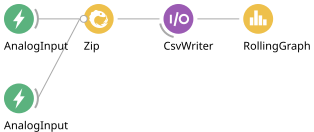
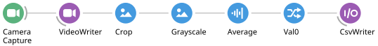

# Data Synchronization

Synchronizing behaviour and other experimental events with stimulation or recorded
neural data is a fundamental component of neuroscience data collection and
analysis. The exercises below will walk you through some common synchronization
problems encountered in systems neuroscience experiments, and how to handle them
using Bonsai.

> [!NOTE]
> Exercise 2 has been converted to the [Hobgoblin](../hobgoblin/index.md).
> Exercises 3 to 6 still use the Arduino `AnalogInput` source and its wiring, and are
> being rewritten.

### **Exercise 1:** Synchronizing video from two webcams

* Insert a `CameraCapture` source and set it to index 0.
* Insert another `CameraCapture` source and set it to index 1.
* Combine both sources using a `WithLatestFrom` combinator.
* Insert a `Concat (Dsp)` operator and set its `Axis` property to 1.
* Insert a `VideoWriter` sink and record a small segment of video.
* **Question:** how would you test the synchronization between the two video streams?

> [!TIP]
> You can use the `FileCapture` source to inspect the video frame by frame by
> setting the `Playing` property to `False`. After setting the `FileName` property
> to match your recorded video, run the workflow, open the source visualizer, then
> right-click on top of the video frame to open up the seek bar at the bottom. You
> can use the arrow keys to move forward and back on individual frames.

## Reaction time

For this and subsequent worksheets, we will use a simple reaction time task as our
model systems neuroscience experiment. In this task, the subject needs to press a
button as fast as possible following a stimulus, as described in the following
diagram:

The task begins with an inter-trial interval (`ITI`), followed by stimulus
presentation (`ON`). After stimulus onset, advancement to the next state can happen
only when the subject presses the button (`success`) or a timeout elapses (`miss`).
Depending on which event is triggered first, the task advances either to the
`Reward` state, or `Fail` state. At the end, the task goes back to the beginning of
the ITI state for the next trial.

### **Exercise 2:** Generating a fixed-interval stimulus

Completed workflow: [`04-synching-02.bonsai`](../workflows/04-synching-02.bonsai)

In this first exercise, you will assemble the basic hardware and software
components required to implement the reaction time task.

#### Wiring

| Component | Pin | Used from |
| --- | --- | --- |
| LED (stimulus) | `GP22` | Exercise 2 |
| Push button (response) | `GP2` | Exercise 3 |

Wire both now, so you do not have to take the board apart between exercises.

> [!NOTE]
> Unlike the Arduino version of this task, there is no need to duplicate the LED wire
> into an analog input to record the stimulus. The Hobgoblin timestamps every message
> it exchanges with the host, so the commands that drive `GP22` and the events reported
> by `GP2` already arrive with device time attached — which is the whole point of the
> exercises that follow.

#### Setting up the device

We will start by using a fixed-interval blinking LED as our stimulus.

* Reproduce the `Commands` / `Device` / `Events` scaffold from
  [Exercise 1 of the closed-loop worksheet](03-closed-loop.md#exercise-1-measuring-serial-port-communication-latency):
  a `BehaviorSubject` named `Commands` with `TypeArguments` set to `HarpMessage`, a
  `Device` source (from `Harp.Hobgoblin`) with its `PortName` configured, and a
  `PublishSubject` named `Events`.

#### Generating the stimulus

* Insert a `Timer` source and set its `DueTime` property to 1 second.
* Insert a `CreateMessage` operator after the `Timer`. Set its `MessageType` property
  to `Write`, its `Payload` to `CreateDigitalOutputSetPayload`, and the payload's
  `DigitalOutputSet` property to `GP22`.
* Insert a `MulticastSubject` and set its `Name` property to `Commands`.

> [!NOTE]
> With an input connected, `CreateMessage` turns every event it receives into a Harp
> message — here, one "raise `GP22`" command per timer tick. Multicasting that message
> to `Commands` sends it to the board, which is how a Harp device replaces the Arduino
> `DigitalOutput` sink.

* Insert a `Delay` operator and set its `DueTime` property to 200 milliseconds.
* Insert a second `CreateMessage` operator. Set its `MessageType` property to `Write`,
  its `Payload` to `CreateDigitalOutputClearPayload`, and the payload's
  `DigitalOutputClear` property to `GP22`.
* Insert another `MulticastSubject` and set its `Name` property to `Commands`.
* Insert a `Repeat` operator.
* Run the workflow and verify that the LED blinks for 200 ms once every second.

> [!NOTE]
> The whole stimulus is a single chain: the `Timer` waits out the inter-trial interval,
> the first pair of nodes turns the LED on, the `Delay` holds it on for 200 ms, the
> second pair turns it off, and `Repeat` starts the sequence again. Nothing here reads from
> `Events` yet — the stimulus is open-loop, and the next exercises add the recording
> and the response.

> [!NOTE]
> **TODO:** this exercise needs a workflow figure. Export one from the Bonsai editor
> with **File → Export Image** and save it as `images/reaction-time-stimulus-hobgoblin.svg`.
> The old Arduino figures (`images/create-arduino.svg`,
> `images/reaction-time-stimulus.svg` and `images/reaction-time-circuit.png`) are kept
> for reference until the remaining exercises are converted.

### **Exercise 3:** Measuring reaction time

* Insert an `AnalogInput` source.
* Set the `Pin` property to the analog pin number where the duplicate LED wire is
  connected.
* Insert a second `AnalogInput` source.
* Set the `Pin` property to the analog pin number where the button is connected.
* Connect both inputs to a `Zip` operator.
* Insert a `CsvWriter` sink and configure the `FileName` property.
* Insert a `RollingGraph` visualizer and set its `Capacity` property to 1000.
* Run the workflow, and verify that both the stimulus and the button are correctly
  recorded.

### **Exercise 4:** Synchronizing video with a visual stimulus

To analyze movement dynamics in the reaction time task, you will need to align
individual frame timing to stimulus onset. To do this, you can take advantage of the
fact that our simple visual stimulus can be seen in the camera image and recorded
together with the behaviour.

* Starting from the workflow in the previous exercise, insert a `CameraCapture`
  source and position the camera such that you can see clearly both the LED and the
  computer keyboard.
* Insert a `VideoWriter` sink and configure the `FileName` with a path ending in `.avi`.
* Insert a `Crop` transform and set the `RegionOfInterest` property to a small area
  around the LED.
* Insert a `Grayscale` transform.
* Insert a `Sum (Dsp)` transform. This operator will sum the brightness values of
  all the pixels in the input image.
* Select the `Scalar` > `Val0` field from the right-click context menu.
* Record the output in a text file using a `CsvWriter` sink.
* Open both the text file containing the Arduino data, and the text file containing
  video data, and verify that you have detected an equal number of stimuli in both
  files. **Question:** what can you conclude from these two pieces of data?
* **Optional:** Open the raw video file and find the exact frame where the stimulus
  came on. If you compare different trials you might notice that the brightness of
  the LED in that first frame across two different trials is different. Why is that?

### **Exercise 5:** Trigger a visual stimulus using a button

To make our task more interesting, we will now trigger the stimulus manually using
a key press, and learn more about `SelectMany` along the way.

* Insert a `KeyDown` source and set its `Filter` property to a keyboard key of choice.
* Insert a `SelectMany` operator and move the stimulus generation logic inside the
  nested node:

* **Question:** why do we need to remove the `Repeat` operator?
* Ask a friend to test your reaction time.
* **Optional:** In the current workflow, what happens if you press the stimulus key
  twice in succession? Can you fix the current behaviour by using one of the
  higher-order operators?

### **Exercise 6:** Recording response-triggered videos

* Starting from the previous workflow, insert another `AnalogInput` source with the
  `Pin` property set to the button press pin number.
* Insert a `GreaterThan` operator.
* Insert a `DistinctUntilChanged` operator.
* Insert a `Condition` operator.
* In a new branch coming off the `VideoWriter`, insert a `Delay` operator.
* Set the `DueTime` property of the `Delay` operator to 1 second.
* Insert a `WindowTrigger` operator, and set its `Count` property to 100.
* Insert a `SelectMany` operator and inside the nested node create the below workflow:

* Run the workflow and record a few videos triggered on the button press.
* Inspect the videos frame by frame and check whether the response LED comes ON at
  exactly the same frame number across different trials.
* **Question:** if it does not, why would this happen? And how would you fix it?

Next: [State Machines](05-state-machines.md).
