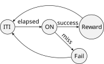
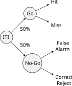
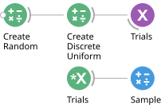
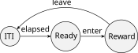

# State Machines

When designing operant behaviour assays in systems neuroscience, it is useful to
describe the task as a sequence of states the system goes through (e.g. stimulus on,
stimulus off, reward, inter-trial interval, etc). Progression through these states
is driven by events, which can be either internal or external to the system
(e.g. button press, timeout, stimulus offset, movement onset). It is common to
describe the interplay between states and events in the form of a finite-state
machine diagram, or graph, where nodes are states and arrows are events.

For example, a simple reaction time task where the subject needs to press a button
as fast as possible following a stimulus is described in the following diagram:

The task begins with an inter-trial interval (`ITI`), followed by stimulus
presentation (`ON`). After stimulus onset, advancement to the next state can happen
only when the subject presses the button (`success`) or a timeout elapses (`miss`).
Depending on which event is triggered first, the task advances either to the
`Reward` state, or `Fail` state. At the end, the task goes back to the beginning of
the ITI state for the next trial.

The exercises below will show you how to translate the above diagram of states and
events into an equivalent Bonsai workflow, which can be easily adapted and modified
to describe many different operant behaviour tasks.

> [!NOTE]
> **TODO:** every workflow figure in exercises 1 to 5 still shows the Arduino version of
> the task and has been removed from the text. Export replacements from the Bonsai editor
> with **File → Export Image** and reference them again:
>
> | Needed figure | Shows |
> | --- | --- |
> | `statemachine-logging-hobgoblin.svg` | the hardware layer, Exercise 1 |
> | `statemachine-stimulus-hobgoblin.svg` | the top-level trial, Exercise 2 |
> | `statemachine-stimulus-led-hobgoblin.svg` | inside `StimOn`, Exercise 2 |
> | `statemachine-stimulus-response-hobgoblin.svg` | inside `Response`, Exercises 3 and 4 |
> | `statemachine-stimulus-response-outcomes-hobgoblin.svg` | the outcome branches, Exercise 5 |
> | `statemachine-stimulus-response-outcomes-reward-hobgoblin.svg` | inside `Reward`, Exercise 5 |
>
> The old Arduino figures (`images/statemachine-*.svg`) are kept in the repository for
> reference until the new ones are in place. The task diagrams themselves
> (`reactiontime-task.svg`, `go-nogo-task.svg`, `placepreference.svg`) describe states
> rather than workflows and are still accurate.

### **Exercise 1:** Declaring and logging external hardware events

Completed workflow: [`05-state-machines-01.bonsai`](../workflows/05-state-machines-01.bonsai)

In this worksheet we will use the [Hobgoblin](../hobgoblin/index.md) as our interface to
the outside world, with the same wiring as the synchronization worksheet: a push button
on `GP2` as the response, and an LED on `GP22` as the stimulus. For experimental
purposes, it is very helpful to record and timestamp _all_ hardware events,
independently of which state the task is in.

#### Logging the response

* Reproduce the `Commands` / `Device` / `Events` scaffold: a `BehaviorSubject` named
  `Commands` with `TypeArguments` set to `HarpMessage`, a `Device` source (from
  `Harp.Hobgoblin`) with its `PortName` configured, and a `PublishSubject` named `Events`.
* Insert a `SubscribeSubject` named `Events`, followed by a `Parse` transform with its
  `Register` property set to `TimestampedDigitalInputState`.
* Insert a `PublishSubject` operator and set its `Name` property to `Response`.
* Insert a `CsvWriter` sink, configure its `FileName` property with a file name ending in
  `.csv`, e.g. `button.csv`, and set `IncludeHeader` to `True`.
* Run the workflow and press the button a couple of times. Stop the workflow and confirm
  that the events were logged in the `.csv` file.

> [!NOTE]
> There is no `Timestamp` operator in this workflow. The Arduino version needed one
> because the host had to note when each sample arrived, but a Harp device timestamps
> events itself, and the `Timestamped` register variant carries that time along with the
> value. The `CsvWriter` writes both columns, so the log holds device time rather than
> host time.

> [!NOTE]
> In order to avoid hardware side-effects, it is highly recommended to declare all
> hardware connections at the top-level of the workflow, and interface all trial
> logic using subject variables. This has the added benefit of allowing very easy
> and centralized replacement of the rig hardware: as long as the new inputs and
> configurations are compatible with the logical subjects, no code inside the task
> logic has to be changed at all.

#### Declaring the stimulus

The task logic should not have to know that the stimulus is an LED on `GP22`, or that
raising and lowering it takes two different Harp registers. We will hide all of that
behind a single boolean variable.

* Insert a `BehaviorSubject` source, set its `TypeArguments` to `Boolean`, and set its
  `Name` property to `Led`.
* Insert a `Condition` operator after it and set its `Name` property to `TurnOn`. Leave
  its contents as the default pass-through.
* After `TurnOn`, insert a `CreateMessage` operator with its `MessageType` set to `Write`,
  its `Payload` set to `CreateDigitalOutputSetPayload`, and the payload's
  `DigitalOutputSet` property set to `GP22`.
* In a new branch from the `Led` subject, insert a second `Condition` named `TurnOff`,
  and insert a `BitwiseNot` between `Source1` and `WorkflowOutput` inside it.
* After `TurnOff`, insert another `CreateMessage`, this time with its `Payload` set to
  `CreateDigitalOutputClearPayload` and the payload's `DigitalOutputClear` property set
  to `GP22`.
* Join both branches with a `Merge` combinator, and insert a `MulticastSubject` named
  `Commands` after it.

> [!NOTE]
> This is the same two-branch inversion used throughout the closed-loop worksheet, but
> packaged as a translation layer: multicasting `True` to `Led` lights the LED and `False`
> extinguishes it, and nothing in the task logic below needs to mention `GP22`, Harp
> registers, or the board at all. Swapping the LED for a valve or a speaker later means
> editing only this section.

### **Exercise 2:** Inter-trial interval and stimulus presentation

Completed workflow: [`05-state-machines-02.bonsai`](../workflows/05-state-machines-02.bonsai)

Translating a state machine diagram into a Bonsai workflow begins by identifying the
initial state of the task (i.e. the beginning of each trial). It is often convenient
to consider the inter-trial interval period as the initial state, followed by
stimulus presentation.

Leave the hardware layer from Exercise 1 alone; everything below is built in a new
branch, and talks to the board only through the `Led` and `Response` subjects.

* Insert a `Timer` source and set its `DueTime` property to be about 3 seconds.
* Insert a `Sink` operator and set its `Name` property to `StimOn`.
* Double-click on the `Sink` node to open up its internal specification.

> [!NOTE]
> The `Sink` operator allows you to specify arbitrary processing side-effects without
> affecting the original flow of events. It is often used to trigger and control
> stimulus presentation in response to events in the task. Inside the nested
> specification, `Source1` represents input events arriving at the sink. In the
> specific case of `Sink` operators, the `WorkflowOutput` node can be safely ignored.

**Inside `StimOn`:**

* Insert a `Boolean` operator following `Source1` and set its `Value` property to `True`.
* Find and right-click the `Led` subject in the toolbox and select the option `Multicast`.
* Run the workflow a couple of times and verify that the LED comes on three seconds after
  the workflow starts.

> [!NOTE]
> The `Led` subject was declared as a `BehaviorSubject` in Exercise 1, so it holds its
> most recent value. Anything that multicasts to it drives the hardware immediately, from
> anywhere in the workflow — which is what lets a state deep inside a nested node control
> the stimulus without any wire running back to the top level.

* In the main top-level workflow, insert a `Delay` operator and set its `DueTime`
  property to 1 second.
* Copy the `StimOn` operator and insert it after the `Delay` (you can either
  copy-paste or recreate it from scratch).
* Rename the new operator to `StimOff` and double-click it to open up its internal
  representation.
* Set the `Value` property of the `Boolean` operator to `False`.
* Run the workflow a couple of times. **Question:** is it behaving as you would expect?
* Insert a `Repeat` operator after the `StimOff`.
* Run the workflow. **Question:** can you describe in your own words what is happening?
* **Optional:** Draw a marble diagram for `Timer`, `StimOn`, `Delay`, and `Repeat`.

### **Exercise 3:** Driving state transitions with external behaviour events

Completed workflow: [`05-state-machines-03.bonsai`](../workflows/05-state-machines-03.bonsai)

* Delete the `Delay` operator.
* Insert a `SelectMany` operator after `StimOn`, and set its `Name` property to `Response`.
* Double-click on the `SelectMany` node to open up its internal specification.

> [!NOTE]
> The `SelectMany` operator is used here to create a new state for every input event.
> `Source1` represents the input event that created the state, and `WorkflowOutput`
> will be used to report the end result from the state (e.g. whether the response was
> a success or failure).

**Inside `Response`:**

* Subscribe to the `Response` subject in the toolbox.
* Insert a `Boolean` operator and set its `Value` property to `True`.
* Insert a `Take` operator and set its `Count` property to 1.
* Connect the `Take` operator to `WorkflowOutput`, leaving `Source1` unconnected.
* Run the workflow a couple of times and validate the state machine is responding to
  the button press.

> [!NOTE]
> The state ends when its nested sequence completes, which is exactly what `Take` with a
> `Count` of 1 does: wait for one response, report `True`, and finish. `Source1` is left
> unconnected because the state does not care what event started it — only that it is now
> waiting for a button press.

> [!TIP]
> The `Response` subject carries *every* change of the digital input register, so
> releasing the button is an event too. `Take` accepts the first one either way, which is
> good enough here because the button starts released. If you would rather the state
> reacted only to presses, filter the subscription the way the
> [synchronization worksheet](04-synching.md) does — a `Condition` selecting `Value` and
> comparing it to `GP2`.

### **Exercise 4:** Timeout and choice

Completed workflow: [`05-state-machines-04.bonsai`](../workflows/05-state-machines-04.bonsai)

**Inside `Response`:**

* Inside the `Response` node, insert a `Timer` source and set its `DueTime` property
  to be about 1 second.
* Insert a `Boolean` operator after the `Timer` and set its `Value` property to `False`.
* Join both `Boolean` operators with a `Merge` combinator, so the button branch is
  `Source1` and the timeout branch is `Source2`.
* Move the `Take` operator after the `Merge`, and connect it to `WorkflowOutput`.
* Run the workflow a couple of times, opening the visualizer of the `Response` node.
* **Question:** describe in your own words what the above modified workflow is doing.

> [!NOTE]
> Both branches now feed the same `Take`, so whichever arrives first ends the state and
> the other is discarded. The boolean that gets through is the outcome of the trial:
> `True` if it came from the button, `False` if it came from the timeout. This is how a
> choice point in the diagram becomes a workflow — not as a branch you evaluate, but as a
> race between the events that could end the state.

### **Exercise 5:** Specifying conditional task outcomes

Completed workflow: [`05-state-machines-05.bonsai`](../workflows/05-state-machines-05.bonsai)

* Insert a `Condition` operator after the `StimOff` node, and set its `Name` property
  to `Success`.
* In a new branch from `StimOff`, insert another `Condition`, and set its `Name`
  property to `Miss`.
* Double-click on the `Condition` operator to open up its internal specification.

> [!NOTE]
> The `Condition` operator allows you to specify arbitrary rules for accepting or
> rejecting inputs. Only inputs which pass the filter specified inside the `Condition`
> are allowed to proceed. It is often used to represent choice points in the task.
> Inside the nested specification, `Source1` represents input events to be tested. The
> `WorkflowOutput` node always needs to be specified with a `bool` input, the result of
> whether the input is accepted (`True`) or rejected (`False`). Usually you can use
> operators such as `Equal`, `NotEqual`, `GreaterThan`, etc. for specifying such tests.

**Inside `Miss`:**

* Insert a `BitwiseNot` operator after `Source1`.
* **Question:** why did we not need to specify anything for the `Success` condition?
* In the top-level workflow, insert a `SelectMany` operator after the `Success`
  condition and change its `Name` property to `Reward`.
* Inside the `Reward` node you can specify your own logic to signal the trial was
  successful. For example, you can make the LED blink three times in rapid succession:

**Inside `Reward`:**

  * Insert a `Timer` node and set both the `DueTime` and the `Period` properties to 100ms.
  * Insert a `Mod` operator and set the `Value` property to 2.
  * Insert the `Equal` operator and leave its `Value` property at 0.
  * Find and right-click the `Led` subject in the toolbox and select the option `Multicast`.
  * Insert a `Take` operator and set the `Count` property to 6.
  * Insert the `Last` operator.
  * Leave `Source1` unconnected, as in the `Response` state.

> [!NOTE]
> The `Timer` counts 0, 1, 2, … every 100 ms; `Mod` and `Equal` turn that counter into an
> alternating boolean, which the `Led` subject renders as a blink. `Take` stops after six
> values — three on-off pairs — and `Last` collapses the whole burst into the single event
> that reports the state is finished.

Try out your state machine and check whether you understand the behaviour of the
reward signal.

* In a new branch after the `Miss` condition, insert another `SelectMany` and set its
  `Name` property to `Fail`. Inside it, insert a `Take` operator with its `Count` set to
  1 between `Source1` and `WorkflowOutput`.

> [!NOTE]
> The `Fail` state deliberately does nothing: `Take` with a `Count` of 1 passes the event
> straight through and completes, which ends the state immediately. A state still has to
> *exist* for the machine to have somewhere to go on a miss, and it still has to complete
> for the trial to end — but signalling anything to the subject is optional.

* **Optional:** Modify the `Fail` state in some way to signal a different trial
  outcome, e.g. blink the LED at a different rate by copying the contents of `Reward`
  and changing the `Period` and `Count`.
* In the top-level workflow, insert a `Merge` operator and connect to it the outputs
  of both conditional branches, before the `Repeat` node.

Try out your state machine and introduce variations to the task behaviour and
conditions.

### **Exercise 6 (Optional):** Go/No-Go task

Implement the following trial structure for a Go/No-Go task.

* Trials should be sampled from a uniform distribution using the `Numerics` package
  (install from `Tools` > `Manage Packages`).
* Response events should be based on a button press, and reject events on a timeout.
* Make sure to implement different visual or auditory feedback for either the cue or
  reward/failure states.

> [!TIP]
> To sample values from a discrete uniform distribution, you can use the following
> workflow:
>
> 

* Record a timestamped chronological log of trial types and rewards into a CSV file
  using a `BehaviorSubject`.

### **Exercise 7 (Optional):** Conditioned place preference

Implement the following trial structure for conditioned place preference. `enter` and
`leave` events should be triggered in real-time from the camera, by tracking an object
moving in or out of a region of interest (ROI). `Reward` should be triggered once upon
entering the ROI, and not repeat again until the object exits the ROI and the ITI has
elapsed.

> [!TIP]
> There are several ways to implement ROI activation, so feel free to explore
> different ideas. Consider using either `Crop`, `RoiActivity`, or `ContainsPoint` as
> part of different strategies to implement the `enter` and `leave` events.
