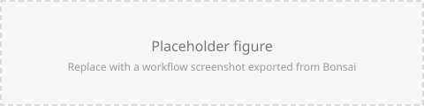

# Worksheet template

Copy this file to `worksheets/NN-my-topic.md`, add it to `worksheets/toc.yml`
and to the table in [Worksheets](index.md), then replace everything below.

## Section heading

One or two sentences introducing the concept, and why it matters for an
experiment. Keep the prose short — the exercises carry the material.

### **Exercise 1:** A short imperative title

* Insert a `SomeSource` source.
* Insert a `SomeSink` sink.
* Configure the `FileName` property with a file name ending in `.avi`.
* Run the workflow and check the output.

### **Exercise 2 (Optional):** A harder variation

* Modify the previous workflow so that it does something extra.
* **Question:** what happens if two sinks subscribe to the same source?

> [!TIP]
> Use tips for the small hints that unblock people without giving away the answer.

> [!WARNING]
> Use warnings for the mistakes that cost people ten minutes.

## Workflow files

Ready-made workflows go in `workflows/` at the repository root and can be
linked directly so people can download and open them:

[`example.bonsai`](../workflows/example.bonsai)

## Screenshots

Export workflow figures as SVG from the Bonsai editor
(**File → Export Image**) and save them in `images/`.
